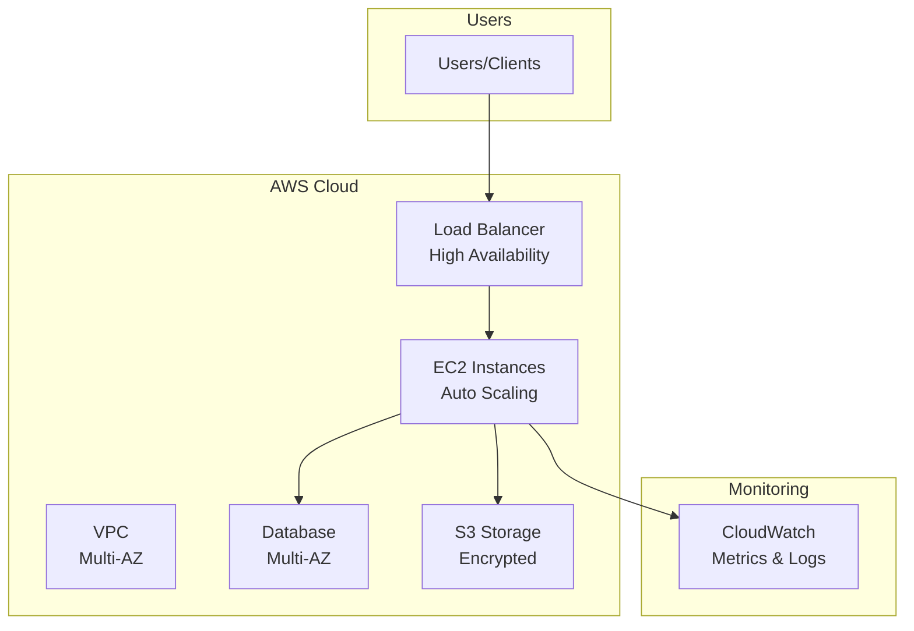

# 🏭 Production-Grade CDK Infrastructure - CDK Python

> **Enterprise CDK patterns** with Python, stack composition, and comprehensive testing

[](https://aws.amazon.com/cdk/)
[](https://aws.amazon.com/)

## 🎯 Problem
Build production-grade infrastructure using AWS CDK with Python, following enterprise patterns, stack composition, and testing.

## 💡 Solution
CDK Python with modular constructs, cross-stack references, comprehensive testing, production-ready patterns.

## 🏗️ Architecture

### High-Level Architecture




## 🚀 Quick Deploy
```bash
python3 -m venv .venv
source .venv/bin/activate
pip install -r requirements.txt
cdk deploy --all
```

## 💰 Cost: ~$100-150/month
## ⏱️ Deploy: 15-20 minutes

## ✨ Features
- ✅ CDK Python best practices
- ✅ Stack composition patterns
- ✅ Cross-stack references
- ✅ Custom constructs
- ✅ Comprehensive testing
- ✅ Production-ready

## 🎯 Perfect For
- Enterprise applications
- Python teams
- Complex architectures
- Reusable patterns

## 👤 Author
**Rahul Ladumor** | rahuldladumor@gmail.com | acloudwithrahul.in

## 📄 License
MIT - Copyright (c) 2025 Rahul Ladumor
